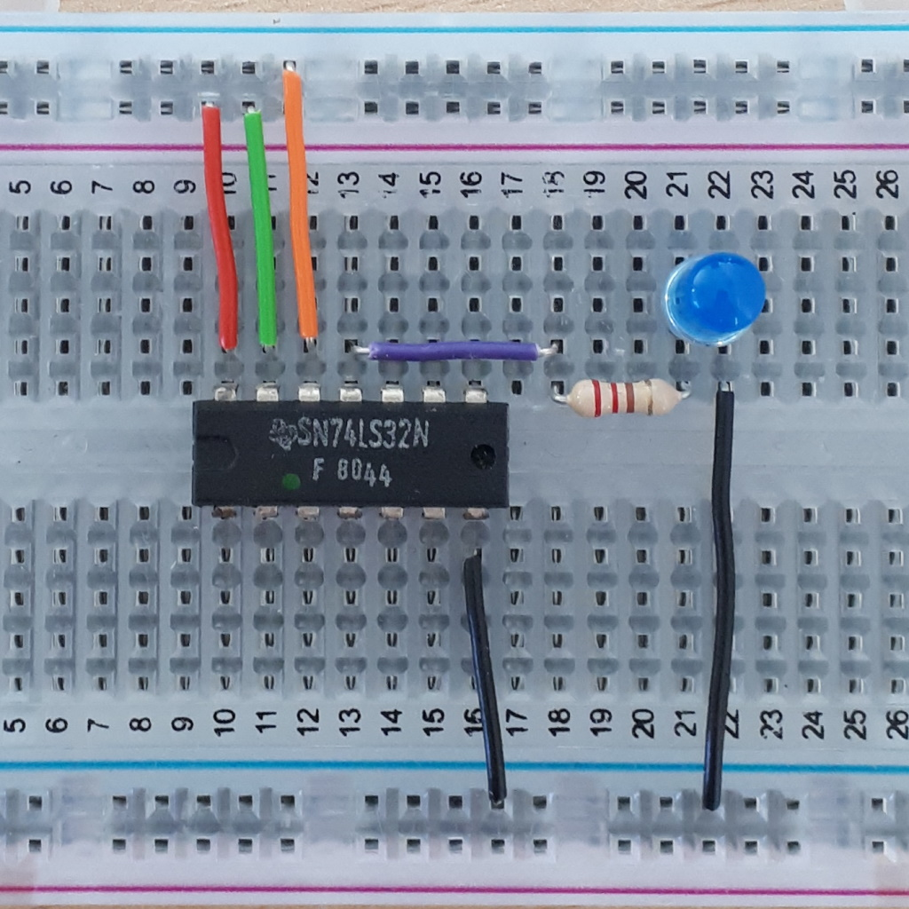
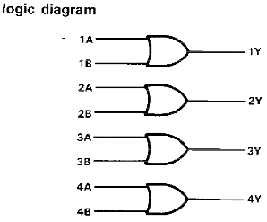

# Ausbildungsinhalte von Mitutoyo CTL Germany GmbH

## Zum Instagram Post vom 12.10.2022

Text aus dem Instagram Post:

> Wenn Du in der Schule etwas über Widerstände gelernt hast, dann vermutlich den Zusammenhang zwischen Widerstand, Strom und Spannung (U=R\*I) und dass der Widerstandswert vom Material, der Länge und dem Querschnitt abhängt (R=ρ\*l/A).
>
> In der Schule arbeitest Du mit einer Idealvorstellung von elektronischen Bauteilen. Im Studium der Informationstechnik stellst Du Dich der Realität und lernst, dass es bei realen Bauteilen wie einem echten Widerstand ganz schön viele Dinge zu berücksichtigen gibt.
>
> Beispielsweise musst Du beachten, welche Leistung ein Widerstand aushält, bevor er in Flammen aufgeht. Oder Du stellst fest, dass Dein selbstgebautes Handy 23 kg wiegt, weil Du nicht auf das Gewicht und die Größe der Widerstände geachtet hast.
>
> Der größte Widerstand im Bild hält übrigens 1000 Watt aus und wird bei Tests von Funkgeräten eingesetzt.

Widerstände kannst Du für folgende Zwecke einsetzen:

* zur Begrenzung des Stroms, z.B. als Vorwiderstand von LEDs
* zur Aufteilung einer großen Spannung in mehrere kleine Spannungen (Reihenschaltung)
* zur Aufteilung eines großen Stroms in mehrere kleine Ströme (Parallelschaltung)
* einen Widerstand allein zur Erzeugung von Wärme

Bei der Auswahl eines Widerstands hast Du bisher vielleicht gedacht, dass Du den Widerstandswert ausrechnest und dann einen Widerstand mit diesem Wert kaufst. Doch so einfach ist das mit echten Widerständen gar nicht...

Folgende Auswahlkriterien können bei Widerständen eine Rolle spielen:

* **Widerstandswert**: sicherlich einer der wichtigsten Faktoren, besonders für Dich als Student. Du berechnest einen Widerstand und möchtest genau den auch haben. Eventuell stellst Du aber fest, dass es den gar nicht zu kaufen gibt. Da gehen wir nachher nochmal drauf ein.
* **Belastbarkeit**: an einem Widerstand liegt eine Spannung an und es fließt ein bestimmter Strom. Strom und Spannung multipliziert ergeben die Leistung, die an diesem Widerstand in Wärme umgewandelt wird. Ist diese Leistung zu hoch, kann der Widerstand zerstört werden und evtl. sogar ein Feuer verursachen. Neben dem Widerstandswert ist das oft die zweitwichtigste Eigenschaft.
* **Montageart**: es gibt Widerstände in Oberflächenmontage (SMD) oder Through-Hole-Technologie (THT) mit Drähten, die man durch Löcher in der Platine stecken kann. Je nach dem, was für eine Platine Du fertigen möchtest, muss Dein Widerstand dazu passen.
* **Toleranz**: Widerstände werden mit einer bestimmten Genauigkeit gefertigt. Wenn Du ein präzises Messgerät aufbaust, verwendest Du Widerstände mit einer geringen Toleranz. Bei einer einfachen Arduino-Schaltung reichen Dir 10% Genauigkeit aus.
* **Baugröße**: Widerstände gibt es in unterschiedlichen Größen (siehe Foto). In ein Smartphone möchtest Du sicherlich eher kleine Widerstände einbauen. Leider hat die Baugröße oft Auswirkungen auf die Belastbarkeit.
* **Preis**: je nach dem, wie viel Budget Du hast und wie viele Widerstände Du brauchst, spielt der Preis eine Rolle. Vielleicht kannst Du durch die Verwendung von mehreren billigen 1/4 Watt Widerständen und Reihenschaltung oder Parallelschaltung auf einen ansonsten teuren 2 Watt Widerstand verzichten.
* **Spannungsfestigkeit**: insbesondere wenn Du mit hohen Spannungen wie z.B. 230V~ arbeitest, möchtest Du, dass Dein Widerstand das auch aushält. Das ist nicht unbedingt gleichzusetzen mit der Belastbarkeit. Beispielsweise kann ein 1 MOhm Widerstand an 230V~ nur eine geringe Belastbarkeit aufweisen (ca. 50mW), muss aber die Spitzenspannung aushalten.
* **Frequenzverhalten**: jeder echte Widerstand ist zu einem kleinen Teil auch ein Kondensator und eine Spule. Wenn Dein Widerstand an einer hochfrequenten Wechselspannung angeschlossen ist, möchtest Du diese Eigenschaften vielleicht so gering wie möglich halten.
* **Temperaturverhalten**: Du hast sicherlich gelernt, dass sich Atome bei hoher Temperatur stärker bewegen und dadurch die Elektronen eher behindern. Wenn Du sicherstellen möchtest, dass sich Deine Schaltung auch bei hohen Temperaturen im Sommer noch korrekt verhält, dann wählst Du Widerstände mit einem geringen Temperaturkoeffizienten.
* **Material**: es gibt Kohleschicht-, Metallschicht- oder Metalloxidwiderstände und vermutlich noch weitere Materialien. Diese Materialien haben noch andere Eigenschaften, z.B. könnten sie magnetisch sein - was zu Deiner Schaltung passt, oder auch nicht.
* **Lagerbestand**: mit einer Parallelschaltung von zwei gleichen Widerständen kannst Du den Widerstandswert halbieren. Wenn Du z.B. noch 1000 Widerstände mit 100 Ohm zur Verfügung hast, und einen 50 Ohm Widerstand brauchst, brauchst Du nicht noch 1000 Widerstände mit 50 Ohm kaufen, sondern kannst deinen Lagerbestand klein halten und aufbrauchen. Im Gegenzug brauchst Du dafür mehr Platz und musst mehr löten.
* **Verfügbarkeit**: in letzter Zeit waren einige elektronische Komponenten ausverkauft oder hatten lange Lieferzeiten von bis zu 1 Jahr. Da lohnt es sich, nochmal nachzuschauen, ob es nicht Alternativen gibt, die kurzfristiger verfügbar sind.

Wenn Du Widerstände kaufst, wirst Du feststellen, dass Du nicht alle Werte kaufen kannst. Außerdem scheinen die Widerstandswerte ziemlich exotisch zu sein. Typische Widerstandswerte sind 10, 12, 15, 18, 22, 27, 33, 39, 47, 56, 68 und 82 Ohm, sowie zehnfache davon. Wie kommt es zu genau diesen Werten? Warum kauft man nicht "gerade" Werte wie 10, 20, 30, 40, ... ?

Die Antwort dafür liegt in der Toleranz. Bei den o.g. Widerstandswerten handelt es sich um Werte mit 10% Toleranz. Wenn Du mal ausrechnest, wie groß der Streubereich bei 10% ist, wirst Du feststellen, dass die Obergrenze von einem Wert mit der Untergrenze vom nächsten Wert übereinstimmt. Ein Beispiel: Ein Widerstand mit einem Nominalwert von 68 Ohm kann bei 10% Toleranz zwischen 61,2 Ohm und 74,8 Ohm liegen. Der nächsthöhere Wert, nominell 82 Ohm, liegt zwischen 73,8 Ohm und 90,2 Ohm.

Hinter den "schrägen" Widerstandswerten liegt also ein ganz praktischer Grund. Außerdem unterscheiden sich dadurch die Farben der Widerstandskennzeichnung (Ringe) besser, was das Ablesen vereinfacht.

Diese "schrägen" Widerstandswerte sortieren wir in sogenannte E-Reihen ein. Bei 10% erhalten wir 12 unterschiedliche Werte (siehe oben), so dass sich die E12-Reihe ergibt. Bei 5% ergeben sich 24 Werte, also die E24-Reihe. Und bei 1% haben wir die E96 Reihe.

Weißt Du jetzt alles über Widerstände? Sicherlich nicht. Beim Lesen hast Du theoretisches Wissen erworben. Im Studium der Informationstechnik kommt noch das praktische Können dazu. Du musst Widerstände mal in die Hand genommen haben, um zu spüren, wie viel die wiegen. Du musst mal gefühlt haben, wie sich Widerstände erwärmen. Und es schadet auch nicht, den Geruch zu kennen, wenn ein Widerstand durchbrennt. 

Solche Experimente kannst Du unter Aufsicht eines erfahrenen Ausbilders durchführen. Während das Experiment für Dich vielleicht trivial erscheint, hat er schon an Dinge gedacht, die Dir nicht aufgefallen sind:

* er gibt Dir ein Labornetzteil, das kurzschlusssicher ist, so dass das Netzteil keinen Schaden nimmt
* er achtet darauf, dass Du eine nicht-brennbare Unterlage verwendest
* er stellt sicher, dass Du den Finger auf die Widerstände legst, solange sie noch kalt sind, damit Du Dir die Finger nicht verbrennst
* er gibt Dir eine Steckdose mit FI-Schutzschalter, so dass im Ernstfall niemand einen lebensbedrohlichen Stromschlag bekommen kann
* er hat die Kollegen informiert, dass sie bei "elektrischem Geruch" nicht in Panik ausbrechen
* er hat den Brandschutzbeauftragten über das Experiment informiert

## Zum Instagram Post vom 8.6.2020

> 
> 
> Wird die LED in dieser Schaltung leuchten?
> 
> Mehr über Digitaltechnik lernst Du im Studium der Informationstechnik bei uns.

> 

Wie im vorherigen Post ist die Schaltung auf dem Steckbrett aufgebaut. Der Chip ist als 74LS32 beschriftet, oder im Detail-Bild als SN74LS32N zu identifizieren. Es handelt sich also wieder um einen Digitalbaustein der 74er-Reihe.

Der Vorsatz SN war eine Abkürzung für "Semiconductor Network" und bedeutete, dass hier mehrere Transistoren zusammengeschaltet waren. Außer Texas Instruments nutzte diese Bezeichnung aber niemand und so wird SN seither mit Texas Instruments in Verbindung gebracht. Neben SN nutzt Texas Instruments auch den Vorsatz TI. 

Das TI Logo ist bei diesem Exemplar nicht besonders gut erkennbar. Wenn Du jedoch öfter mit ICs bastelst, wirst Du mit der Zeit auch Logos in schlechterer Qualität erkennen.

Andere Kürzel sind:
* AD: Analog Devices
* AM: Advanced Micro Devices (eher bekannt unter der Abkürzung AMD)
* HD: Hitachi
* LM: National Semiconductor
* Z: Zilog

Der Suffix hängt vom Hersteller ab. Bei Texas Instruments handelt es sich um die Bauform ("package"). N bezeichnet einen Dual In-Line (DIL) Chip aus Plastik. J hätte ein ähnliches Aussehen, wäre aber aus Keramik gefertigt.

Häufiger als DIL wirst Du vermutlich den Begriff DIP für "DIL package" finden. "Dual" steht für die zwei und "Line" für Reihe, d.h. der Chip hat zwei Reihen mit Pins. Es gibt auch SIP (Single In-Line Package) mit nur einer Reihe von Beinchen.

Diese Bauformen sind für die Durchsteckmontage hergestellt. Der englische Begriff THT (through hole technology) macht es deutlich: diese Chips werden in der Anwendung durch Löcher (Bohrungen) gesteckt und dann verlötet.

Mit Hilfe des [TI Datenblatts für den 74LS32](http://www.ti.com/lit/ds/symlink/sn74ls32.pdf?HQS=TI-null-null-mousermode-df-pf-null-wwe&ts=1591626690153) ermittelst Du wieder die Funktion des Chips, kannst die Belegung der Pins herausfinden und anhand der Drähte die Schaltung analysieren.

Es handelt sich um ein Quadruple 2-Input Positive-Or Gate. "Or Gate" beschreibt die Funktion: es handelt sich um die Oder-Verknüpfung. "Positive" sagt, dass der Chip seine Funktion bei einer "hohen" Spannung ausführt, also bei einer digitalen Eins. "2-Input" sagt, dass die Oder-Funktion zwei Eingänge besitzt. Und "Quadruple" sagt, dass die Funktion viermal verfügbar ist. 

In einer Funktionstabelle für zwei digitale Eingänge würdest Du vielleicht 2²=4 Zeilen erwarten. TI kürzt da jedoch mit einem X für beliebige Werte:

Das Logik-Diagramm:

Die Pin-Belegung:

Damit ergibt sich folgende Schaltung:

Die Aussage HIGH OR LOW ergibt HIGH, womit die LED leuchten sollte, falls alle anderen Voraussetzungen gegeben sind.

## Zum Instagram Post vom 15.5.2020

> 
>
> Was passiert, wenn die Spannungsversorgung hergestellt wird?
>
> Skill required: Datenblatt lesen

Es handelt sich bei der Abbildung um den Aufbau einer Digitalschaltung auf einem Steckbrett, auch als Breadboard bekannt.

Der verwendete Chip ist als 74LS04 gekennzeichnet. Um herauszufinden, welche Funktionalität dieser Chip bietet, ist entweder ein gutes Erinnerungsvermögen und Erfahrung nötig, oder man zieht ein Datenblatt zu Rate.

Datenblätter gibt es hoffentlich vom Lieferant (wir bestellen z.B. Reichelt oder Conrad), von anderen Lieferanten (z.B. Mouser) oder idealerweise direkt vom Hersteller (z.B. von Texas Instruments). Im Studium ist die Primärquelle vorzuziehen.

In diesem Fall stehen zum Beispiel folgende Quellen zur Verfügung:

* [74LS04 Datenblatt bei Reichelt](https://cdn-reichelt.de/documents/datenblatt/A200/IX645506.pdf)
* Mouser verlinkt direkt auf Texas Instruments
* [74LS04 Datenblatt bei Texas Instruments](http://www.ti.com/lit/ds/symlink/sn74ls04.pdf?HQS=TI-null-null-mousermode-df-pf-null-wwe&ts=1589539758225)

Der Titel des Datenblatts sagt "Hex Inverters". "Inverter" meint die NOT Funktion, "Hex" ist die Anzahl, also 6 Stück davon in diesem Chip.

Wer das nicht schon wusste, findet spätestens auf Seite 2 die zugehörige Logiktabelle:

Die Datenblätter gelten oft nicht nur für einen einzelnen Chip, sondern für alle Ausführungen davon, beispielsweise unterschiedliche Gehäuseformen (THT und SMD). Im vorliegenden Fall gibt es drei Ausführungen:

Die letzte Bauform passt allein aufgrund der Form nicht zum Bild. Die mittlere Variante gilt nur für die 54er-Version, nicht aber für die 74er-Version. In diesem Fall ist also schon recht schnell geklärt, welche Pinbelegung der Chip haben muss.

Du kannst nun gedanklich den Chip aus dem Datenblatt auf die Schaltung legen. Achte dabei auf die Einkerbung (das Halbrund), also etwa so:

Nun kannst Du schon sehen, wie die Verbindungen hergestellt sind:

* der rote Draht führt von der Plus-Schiene zu Pin 14 (VCC)
* ein schwarzer Draht führt von der Minus-Schiene zu Pin 7 (GND)
* ein grüner Draht führt von Plus zu Pin 13 (6A)
* ein blauer Draht von Pin 12 (6Y) zu Pin 9 (4A)
* ein Widerstand von Pin 8 (4Y) zu Zeile 19 des Breadboards
* eine LED von Zeile 19 des Breadboards zu Zeile 20 des Breadboards
* ein schwarzer Draht von Zeile 20 des Breadboards zu Minus

Das Logikdiagramm auf Seite 3 sagt Dir, wie die NOT-Gatter verschaltet sind, d.h. welche Pins Eingänge und Ausgänge sind:

Im vorliegenden Fall kommt also ein HIGH Signal (Plus, grüner Draht) zum Eingang 6A. 
Dieses bewirkt ein LOW Signal am Ausgang 6Y. Von dort wird es weitergeführt (blauer Draht) zum Eingang 4A.
Das LOW Signal von 4A bewirkt ein HIGH Signal am Ausgang 4Y. Von dort wird es über den Widerstand zur LED geleitet.
Sofern die LED richtig herum eingebaut ist (auf dem Bild schlecht erkennbar), und der Ausgang leistungsstark genug ist, um genügend Strom für die LED bereitzustellen, wird die LED leuchten.

